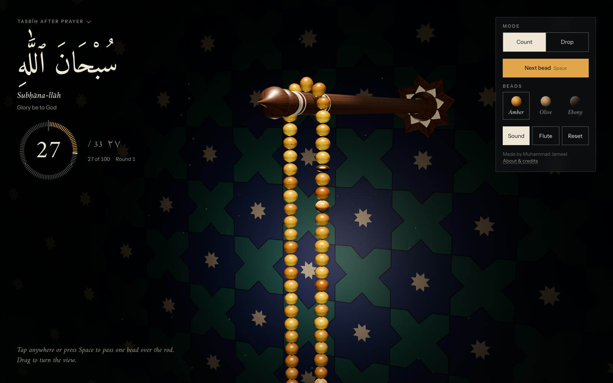
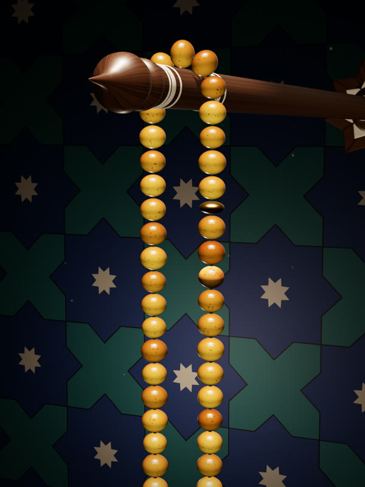
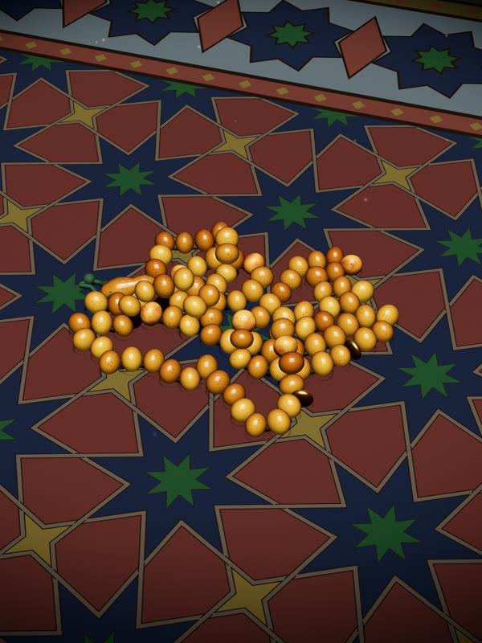
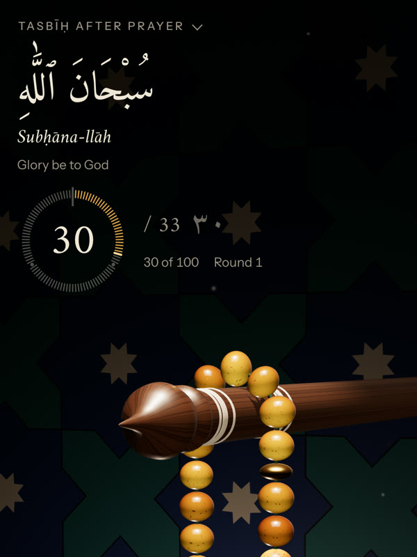

# Misbaḥa · prayer beads for dhikr

**Live:** https://jameel7007.github.io/misbaha/

A misbaḥa (also *subḥa*, or *tasbīḥ*) is a strand of beads for keeping count in dhikr, the
remembrance of God, so the heart can stay with the words rather than the numbers. This one hangs in
lamplight from a turned walnut rod, over a tiled wall and a prayer rug: ninety-nine amber beads in
three thirty-threes, two brass separators and the long imām bead. Press Space or tap, and one bead
passes over the rod; the phrase, the count and a ring of ticks follow it, a bell sounds at each
thirty-three, and the hundredth closes with the full tahlīl.



| Counting | Drop: the strand on the rug | On a phone |
|---|---|---|
|  |  |  |

Everything is rendered live in the browser: every bead is simulated, every pattern is drawn by
code, and nothing on screen is a video or a photograph.

## How it works, in plain language

- **The strand is simulated, not animated.** 102 bodies (99 beads, two separators, the imām) and a
  tassel cord, held together by thread constraints and pushed apart where they touch: a small
  *position-based dynamics* solver at a fixed 60 steps a second, 12 sub-steps each. Rendering only
  reads its arrays. A pass carries one bead over the rod along an arc; taps made while a bead is
  moving are queued, never dropped, so a fast run of 99 counts exactly 99.
- **Drop.** The rod slides back into the wall and the strand falls onto the rug; any bead can be
  dragged. Back in Count, the strand is lifted and the rod slides out under it.
- **Amber that reads as amber.** Real see-through materials refract the dark room and turn muddy,
  so the beads are a polished solid resin with a shader-made inner glow, cognac to honey, with a few
  cloudy butterscotch beads. Olive wood and ebony are the other choices.
- **A room built from a craft tradition.** The rug is a Hankin-method interlaced star pattern in
  natural dyes (madder, indigo, weld, walnut); the wall is Kashan-style star-and-cross tilework in
  cobalt and turquoise; one warm lamp lights the strand and almost nothing else.
- **A colour system you can check.** Every room colour is defined in OKLCH with rules (the beads
  stay the brightest and most saturated thing, grounds keep clear of the beads' hues). Two scripts
  check the rules on the material colours and then on what actually reaches the screen under the
  lamp. Where a rule is knowingly broken, the reason is written down and printed on every run.
- **The rod.** Lathe-turned walnut with a minaret-like finial, mother-of-pearl inlay with an
  iridescent sheen, and an eight-pointed star rosette where it enters the wall.
- **Dhikr sets.** The after-prayer tasbīḥ (33 · 33 · 33 and the tahlīl, or 33 · 33 · 34),
  istighfār and ṣalawāt to a hundred, a plain counter, or your own phrase and target. Each set
  remembers its count on the device.
- **Sound.** A short filtered click per bead, a muffled tap for each landing on the rug, struck-bowl
  bells at 33, 66 and 100, and *Flute*: phrases of the ney, the reed flute of Sufi music, played one
  at a time with silences between, so it never loops audibly.
- **It adapts to the device.** On phones the controls become a bar with a sheet, and the camera
  frames the rod and the beads into the space the text leaves free. An adaptive quality governor
  sets the pixel density and shadow resolution from the device and then from its own frame times;
  a step down that doesn't speed frames up (a 30 fps cap, say) is undone.
- **Accessible.** Every control is 44 px or more and reachable by Tab, with visible focus; Space,
  Enter or ↓ count from anywhere; `prefers-reduced-motion` removes the camera moves and makes passes
  instant; the count is announced to screen readers.

The full account, stage by stage, including the decisions that turned out wrong first, is in
[docs/architecture.md](docs/architecture.md).

## The words

The three phrases after the prayer, each said thirty-three times, and the completion of the
hundred with the tahlīl (*lā ilāha illa-llāhu waḥdahu lā sharīka lah, lahu-l-mulku wa lahu-l-ḥamdu,
wa huwa ʿalā kulli shayʾin qadīr*) follow the narration in Ṣaḥīḥ Muslim; the 33 · 33 · 34 form
follows another narration. Practice varies, so follow your own teacher.

## Built with

Three.js r169 (WebGL 2), plain JavaScript ES modules, Vite. Fonts are self-hosted (Amiri and
Instrument Sans via Fontsource). No other runtime dependencies. The checks and captures are Node
scripts driving headless Chrome through `playwright-core`.

## Run it

```bash
npm install
npm run dev            # http://localhost:5173
npm run build          # production build → dist/
npm run preview        # serve dist/
npm run build:single   # one self-contained HTML file → dist-single/index.html
```

Deployment is a GitHub Actions workflow (`.github/workflows/pages.yml`) that checks the palette,
runs the tests, builds, and publishes `dist/` to GitHub Pages on every push to `main`. A CI workflow
runs the same checks on pull requests and other branches.

## Quality

- `npm run check`: the palette rules on the daylight colours, the unit tests and the build (what CI
  runs).
- `npm test`: the dhikr sets (blocks, bells, completion, saved progress surviving corrupt data) and
  the quality governor (driven by simulated frame times: an iPhone's first guess, a 30 fps cap, a
  pixel-bound load, a very slow device, recovery).
- `npm run verify:colour` (needs the dev server): renders the scene in headless Chrome on the real
  GPU and checks the colour rules on the pixels, including that no hotspot outshines the beads.
- `npm run calibrate:colour`: the lamp's white balance, as a colour temperature.
- Interaction, layout and cross-browser checks (Chrome, WebKit, Firefox, an emulated iPhone) were
  run headless at each stage; the method and results are recorded in the architecture notes.

## Repository map

| Path | What |
|---|---|
| `src/physics.js` | the simulation: every array, `step()`, the rod's collider |
| `src/strand.js` | beads, separators, imām, thread and tassel meshes; amber's shader |
| `src/rod.js` | the turned walnut rod, its finial, collar, inlay and star rosette |
| `src/scene.js` | renderer, lamp, wall glow, reflections, rug and wall, camera rig and phone framing |
| `src/textures.js` | procedural textures: wood grain, amber, fringe, the rug, the wall tiles |
| `src/palette.js` | every room colour in OKLCH, the colour rules and their written waivers |
| `src/main.js` | boot, counting and mode controller, frame loop |
| `src/dhikr.js` | the dhikr sets, what to show at each count, saved progress |
| `src/ui.js` | title, phrase, tally ring, controls and phone sheet, set picker, About, the hundredth |
| `src/input.js`, `src/cursor.js` | pointer and keyboard input; the desktop cursor (Pass, Drag, Turn) |
| `src/audio.js`, `src/ney/` | clicks, landings, bells; the ney recordings and their phrases |
| `src/quality.js`, `src/fill.js`, `src/dust.js` | adaptive quality; bounce fill; dust in the beam |
| `scripts/` | colour checks and calibration, phrase finding, share image, screen capture |
| `tests/` | unit tests (`node --test`) |
| `docs/` | the architecture notes and README images |
| `reference/` | the build spec and the single-file page the project started from |

## Credits

Made by Muhammad Jameel ([@Jameel7007](https://github.com/Jameel7007)). Type: Amiri by Khaled Hosny
and Instrument Sans by Rodrigo Fuenzalida, both SIL Open Font License. The ney recordings are from
Freesound: [ney](https://freesound.org/people/xserra/sounds/115398/) played by Hamza Zeytinoğlu,
recorded by xserra (CC BY 4.0), and recordings by avnonsen, aliaref and KasDonatov (CC0); see
[src/ney/SOURCES.md](src/ney/SOURCES.md).

Code: [MIT](LICENSE). The recordings and fonts keep their own licences.
